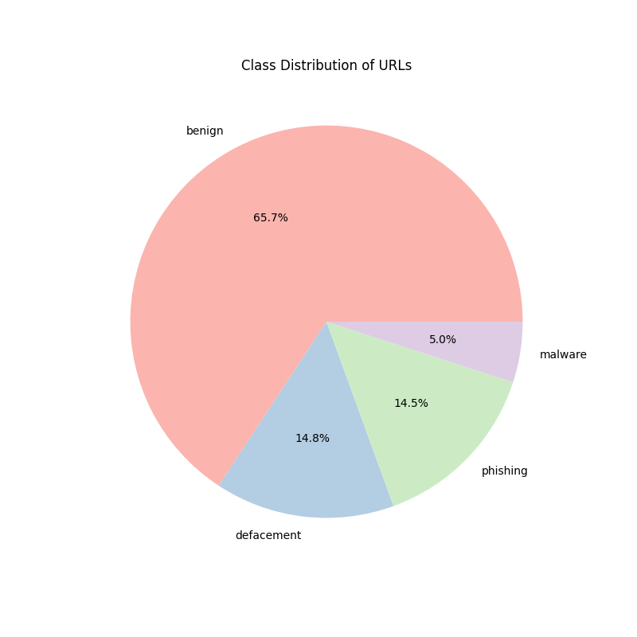

# Malicious URL Classifier

This project classifies URLs as malicious or benign using an ensemble of machine learning models (XGBoost, KNN, MLP, SVM and GNB) with a combination phase using weighted voting.


## Table of Contents
1. [Prerequisites](#prerequisites)
2. [How to run with Docker](#how-to-run-with-docker)
3. [Running Locally](#running-locally)

## Dataset
The dataset was acquired from [kaggle](https://www.kaggle.com/datasets/sid321axn/malicious-urls-dataset).  

The dataset consists of 651,191 unique URLs across four categories, making it robust enough for deep learning and ensemble methods



According to our findings, the dataset is highly imbalanced. The majority of the 651,191 samples are benign (65.7%), while malicious categories like defacement (14.8%), phishing (14.5%), and malware (5.0%) make up the minority. This imbalance necessitates the use of our ensemble approach and metrics like F1-Score to ensure minority classes are predicted accurately.

### Raw Data Sample
| url | type |
| --- | --- |
| br-icloud.com.br | phishing |
| mp3raid.com/music/krizz_kaliko.html | benign |
| http://www.garage-pirenne.be/index.php... | defacement |

## Feature Engineering
Due to the presence of only a single feature: `url`, training would not be effective as there is not enough information for the model to effectively classify whether its malignent or benign. Therefore, to provide more information to our ensemble we divided the `url` feature into further sub-features. The new features are:
- URL Length
- Dot count
- Digits count
- Domain name
- Hostname check
- Secure HTTP
- Contain digit
- Letters count
- Has shortening service
- Has standard IP Address

## Models
According to this [study](https://www.sciencedirect.com/science/article/pii/S1568494621006104?via%3Dihub#sec3.1), an effective ensemble should contain diverse classifiers of different types. The classifiers used in this study are:
- XGBoost
- K-Nearest Neighbor
- MLP
- Gaussian Naive Bayes
- SGD

The diversity of classifiers in an ensemble allows for effective search through the search space. This enables ensembles to find niche results all across the solution space that single classifiers cannot.

## Workflow
The project follows a standard machine learning pipeline as orchestrated in `main.py`:
1.  **Data Loading:** Downloads the dataset from Kaggle using `kagglehub` and loads it into a pandas DataFrame (`src/data_loader.py`).
2.  **Feature Engineering:** Extracts the 10 numerical and categorical features from the raw URL strings (`src/features.py`).
3.  **Label Encoding:** Converts the categorical `type` labels (benign, defacement, phishing, malware) into numerical values for the models.
4.  **Model Initialization:** Initializes the individual classifiers (XGBoost, KNN, MLP, SVM, GNB) and the ensemble VotingClassifier (`src/models.py`).
5.  **Evaluation:** Trains and evaluates the models using a 5-fold cross-validation pipeline with standard scaling, and reports the performance metrics (`src/evaluate.py`).

## Evaluation
The metrics used in this study are:
- Accuracy: The proportion of all classifications that were correct, whether positive or negative.
- Recall: The true positive rate (TPR), or the proportion of all actual positives that were classified correctly as positives.
- Precision: The proportion of all the model's positive classifications that are actually positive.
- F1 Score: The harmonic mean of the precision and recall.

## Prerequisites

- Docker installed on your machine.

## How to Run with Docker

1.  **Build the Docker image:**

    Open your terminal in the project directory and run:

    ```bash
    docker build -t malicious-url-classifier .
    ```

2.  **Run the container:**

    Once the build is complete, run the application:

    ```bash
    docker run --rm malicious-url-classifier
    ```

    The `--rm` flag automatically removes the container after it finishes running to save space.

3.  **Run the analysis script:**

    To view the nature of the dataset using the cache:
in
    ```bash
    docker run --rm -v $(pwd)/kaggle_cache:/root/.cache/kagglehub malicious-url-classifier python -m src.analyze
    ```

4.  **Plot analysis graphs:**

    To create plots of the dataset using the container:
    ```bash
    docker run -v $(pwd)/outputs:/app/outputs malicious-url-classifier python -m src.analyze
    ```

## Notes

- The script uses `kagglehub` to download the dataset. If the dataset requires authentication, you may need to pass your Kaggle credentials as environment variables:
    ```bash
    docker run --rm -e KAGGLE_USERNAME=your_username -e KAGGLE_KEY=your_key malicious-url-classifier
    ```
- The dataset is downloaded inside the container. To persist the dataset between runs (to avoid re-downloading), you can mount a volume:
    ```bash
    docker run --rm -v $(pwd)/kaggle_cache:/root/.cache/kagglehub malicious-url-classifier
    ```

## Running Locally

To run the analysis script locally without Docker, execute the following from the project root:

```bash
pip install -r requirements.txt
python3 -m src.analyze
```
